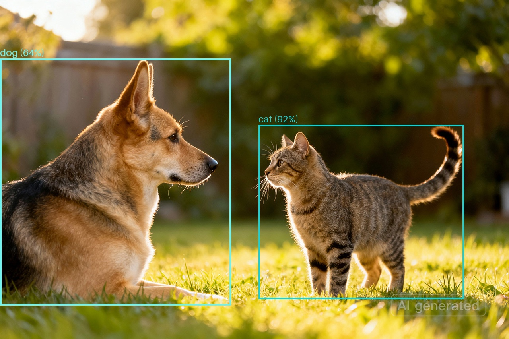
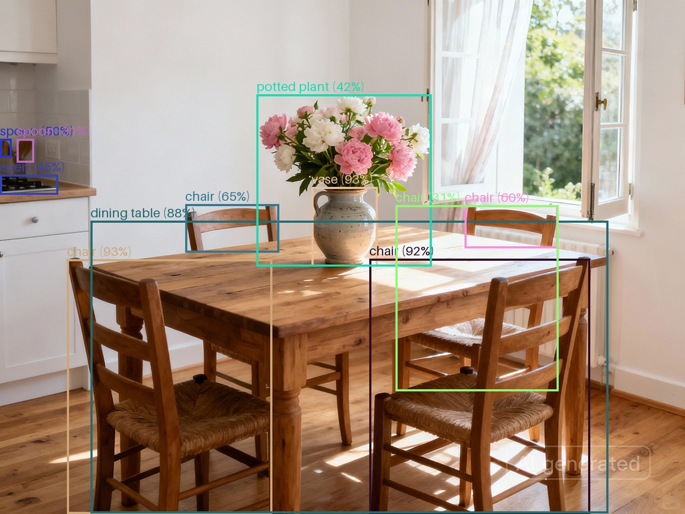

# Real-Time Object Detection with YOLO11 and Amazon SageMaker

Learn how to deploy and performance test the state-of-the-art YOLO11 object detection model to Amazon SageMaker AI using PyTorch for production-ready, real-time inference with GPU acceleration. For more information see the blog post: [Real-Time Object Detection with YOLO11 and Amazon SageMaker AI](https://garystafford.medium.com/real-time-object-detection-with-yolo11-and-amazon-sagemaker-38b7476c1e2f).





## Features

- Downloads pre-trained YOLO11l model weights
- Creates SageMaker-compatible model artifact
- Deploys real-time endpoint with GPU acceleration (ml.g4dn.xlarge)
- Custom PyTorch inference handler (framework version 2.6.0)
- Supports JPEG and PNG image formats
- Includes performance testing with Locust

## Contents

- `deploy_yolo.ipynb` - End-to-end deployment notebook
- `code/` - SageMaker model code directory
  - `inference.py` - Custom SageMaker inference handler
  - `requirements.txt` - Python dependencies
- `sample_images/` - Sample images for testing
- `locust_scripts/` - Performance testing scripts
- `previews/` - Sample detection results

## Inference Pipeline

```text
┌─────────────────┐
│   Image Input   │ (JPEG/PNG)
│   (HTTP POST)   │
└────────┬────────┘
         │
         ▼
┌─────────────────┐
│   input_fn()    │ Decode & validate image
└────────┬────────┘
         │
         ▼
┌─────────────────┐
│    predict_fn   │ Run inference on GPU
│    (PyTorch)    │ with confidence threshold
└────────┬────────┘
         │
         ▼
┌─────────────────┐
│  output_fn()    │ Format detection results
└────────┬────────┘
         │
         ▼
┌─────────────────┐
│  JSON Response  │ Bounding boxes, classes,
│   (HTTP 200)    │ confidence scores
└─────────────────┘
```

## Prerequisites

- AWS account with SageMaker access
- Python 3.12+
- Jupyter notebook environment

## Usage

1. Login to your AWS account on the commandline: `aws login`
2. Create a Python virtual environment (see below)
3. Run the Jupyter notebook [deploy_yolo.ipynb](deploy_yolo.ipynb)
   - Downloads YOLO11l model weights
   - Packages model artifact with inference code
   - Deploys to SageMaker real-time endpoint
   - Tests object detection on sample images
4. Optionally, use `locust_scripts/` to load test your endpoint (see [README.md](locust_scripts/README.md))

## Install Requirements (Mac with `pip`)

```bash
python -m pip install virtualenv --break-system-packages -Uq
python -m venv .venv
source .venv/bin/activate
```

## License

This project is licensed under the MIT License. See the [LICENSE](LICENSE) file for details.

## Disclaimer

The contents of this repository represent my viewpoints and not those of my past or current employers, including Amazon Web Services (AWS). All third-party libraries, modules, plugins, and SDKs are the property of their respective owners.
